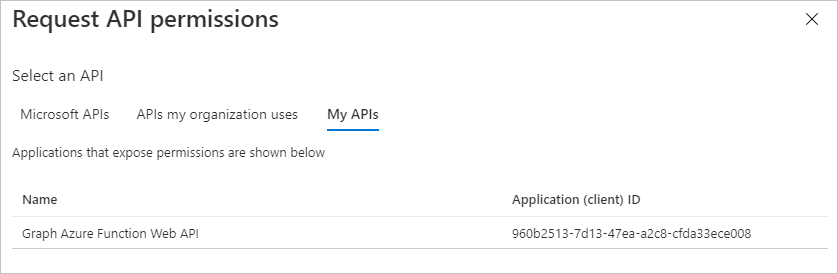
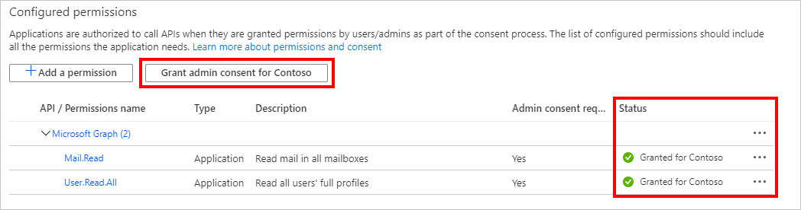

<!-- markdownlint-disable MD002 MD041 -->

Dans cet exercice, vous allez créer trois nouvelles applications Azure AD à l’aide du centre d’administration Azure Active Directory :In this exercise you will create three new Azure AD applications using the Azure Active Directory admin center:

- Inscription d’application pour l’application à page unique afin qu’elle puisse se connecter aux utilisateurs et obtenir des jetons permettant à l’application d’appeler la fonction Azure.An app registration for the single-page application so that it can sign in users and get tokens allowing the application to call the Azure Function.
- Inscription de l’application pour la fonction Azure qui lui permet d’utiliser le flux de la [part de](https://docs.microsoft.com/azure/active-directory/develop/v2-oauth2-on-behalf-of-flow) pour échanger le jeton envoyé par le spa pour un jeton qui lui permettra d’appeler Microsoft Graph.An app registration for the Azure Function that allows it to use the [on-behalf-of flow](https://docs.microsoft.com/azure/active-directory/develop/v2-oauth2-on-behalf-of-flow) to exchange the token sent by the SPA for a token that will allow it to call Microsoft Graph.
- Inscription d’une application pour le webhook de fonction Azure qui lui permet d’utiliser le [flux d’informations d’identification du client](https://docs.microsoft.com/azure/active-directory/develop/v2-oauth2-client-creds-grant-flow) pour appeler Microsoft Graph sans utilisateur.An app registration for the Azure Function webhook that allows it to use the [client credential flow](https://docs.microsoft.com/azure/active-directory/develop/v2-oauth2-client-creds-grant-flow) to call Microsoft Graph without a user.

> [!NOTE]
> Cet exemple nécessite trois inscriptions d’application, car il implémente à la fois le flux de la part de et le flux d’informations d’identification du client.This example requires three app registrations because it is implementing both the on-behalf-of flow and the client credential flow. Si votre fonction Azure utilise uniquement l’un de ces flux, il vous suffit de créer les inscriptions d’application qui correspondent à ce flux.If your Azure Function only uses one of these flows, you would only need to create the app registrations that correspond to that flow.

1. Ouvrez un navigateur et accédez au [Centre d’administration Azure Active Directory](https://aad.portal.azure.com) et connectez-vous à l’aide d’un administrateur de l’organisation client Microsoft 365.Open a browser and navigate to the [Azure Active Directory admin center](https://aad.portal.azure.com) and login using an Microsoft 365 tenant organization admin.

1. Sélectionnez **Azure Active Directory** dans le volet de navigation gauche, puis sélectionnez **Inscriptions d’applications** sous **Gérer**.Select **Azure Active Directory** in the left-hand navigation, then select **App registrations** under **Manage**.

    

## Inscrire une application pour l’application à page uniqueRegister an app for the single-page application

1. Sélectionnez **Nouvelle inscription**.Select **New registration**. Sur la page **Inscrire une application** , définissez les valeurs comme suit.On the **Register an application** page, set the values as follows.

    - Définissez le **Nom** sur `Graph Azure Function Test App`.Set **Name** to `Graph Azure Function Test App`.
    - Définissez les types de comptes **pris en charge** sur les **comptes dans ce répertoire d’organisation uniquement**.Set **Supported account types** to **Accounts in this organizational directory only**.
    - Sous **URI de redirection** , définissez la liste déroulante sur **une application à page unique (Spa)** et définissez la valeur sur `http://localhost:8080` .Under **Redirect URI** , change the dropdown to **Single-page application (SPA)** and set the value to `http://localhost:8080`.

    

1. Sélectionner **Inscription**.Select **Register**. Sur la page **application de test de fonction Azure Graph** , copiez les valeurs de l’ID d' **application (client)** et de l' **ID de répertoire (client)** , puis enregistrez-les dans les étapes ultérieures.On the **Graph Azure Function Test App** page, copy the values of the **Application (client) ID** and **Directory (tenant) ID** and save them, you will need them in the later steps.

    

## Inscrire une application pour la fonction AzureRegister an app for the Azure Function

1. Revenez aux **inscriptions de l’application** et sélectionnez **nouvelle inscription**.Return to **App Registrations** , and select **New registration**. Sur la page **Inscrire une application** , définissez les valeurs comme suit.On the **Register an application** page, set the values as follows.

    - Définissez le **Nom** sur `Graph Azure Function`.Set **Name** to `Graph Azure Function`.
    - Définissez les types de comptes **pris en charge** sur les **comptes dans ce répertoire d’organisation uniquement**.Set **Supported account types** to **Accounts in this organizational directory only**.
    - Laissez l' **URI de redirection** vide.Leave **Redirect URI** blank.

1. Sélectionnez **Inscrire**.Select **Register**. Sur la page de la **fonction Graph Azure** , copiez la valeur de l' **ID d’application (client)** et enregistrez-la, vous en aurez besoin à l’étape suivante.On the **Graph Azure Function** page, copy the value of the **Application (client) ID** and save it, you will need it in the next step.

1. Sélectionnez **Certificats et secrets** sous **Gérer**.Select **Certificates & secrets** under **Manage**. Sélectionnez le bouton **Nouveau secret client**.Select the **New client secret** button. Entrez une valeur dans **Description** , sélectionnez une des options pour **Expire le** , puis sélectionnez **Ajouter**.Enter a value in **Description** and select one of the options for **Expires** and select **Add**.

    

1. Copiez la valeur due la clé secrète client avant de quitter cette page.Copy the client secret value before you leave this page. Vous en aurez besoin à l’étape suivante.You will need it in the next step.

    > [!IMPORTANT]
    > Ce secret client n’apparaîtra plus jamais, aussi veillez à le copier maintenant.This client secret is never shown again, so make sure you copy it now.

    

1. Sélectionnez **autorisations d’API** sous **gérer**.Select **API Permissions** under **Manage**. Choisissez **Ajouter une autorisation**.Choose **Add a permission**.

1. Sélectionnez **Microsoft Graph** , puis **autorisations déléguées**.Select **Microsoft Graph** , then **Delegated Permissions**. Ajoutez **mail. Read** et sélectionnez **Ajouter des autorisations**.Add **Mail.Read** and select **Add permissions**.

    

1. Sélectionnez **exposer une API** sous **gérer** , puis choisissez **Ajouter une étendue**.Select **Expose an API** under **Manage** , then choose **Add a scope**.

1. Acceptez l' **URI d’ID d’application** par défaut et choisissez **enregistrer et continuer**.Accept the default **Application ID URI** and choose **Save and continue**.

1. Renseignez le formulaire **Ajouter un étendue** comme suit :Fill in the **Add a scope** form as follows:

    - **Nom de l’étendue :** Mail. Read**Scope name:** Mail.Read
    - **Qui peut consentir ?:** Administrateurs et utilisateurs**Who can consent?:** Admins and users
    - **Nom d’affichage du consentement de l’administrateur :** Lire les boîtes de réception de tous les utilisateurs**Admin consent display name:** Read all users' inboxes
    - **Description du consentement administratif :** Permet à l’application de lire la boîte de réception de tous les utilisateurs**Admin consent description:** Allows the app to read all users' inboxes
    - **Nom d’affichage du consentement de l’utilisateur :** Lire votre boîte de réception**User consent display name:** Read your inbox
    - **Description du consentement de l’utilisateur :** Permet à l’application de lire votre boîte de réception**User consent description:** Allows the app to read your inbox
    - **État :** Activé**State:** Enabled

1. Sélectionnez **Ajouter une étendue**.Select **Add scope**.

1. Copiez la nouvelle étendue, vous en aurez besoin plus tard.Copy the new scope, you'll need it in later steps.

    

1. Sélectionnez **manifeste** sous **gérer**.Select **Manifest** under **Manage**.

1. Recherchez `knownClientApplications` dans le manifeste et remplacez sa valeur actuelle `[]` par `[TEST_APP_ID]` , où `TEST_APP_ID` est l’ID d’application de l’inscription de l’application de test de la **fonction Azure de graphique** .Locate `knownClientApplications` in the manifest, and replace it's current value of `[]` with `[TEST_APP_ID]`, where `TEST_APP_ID` is the application ID of the **Graph Azure Function Test App** app registration. Sélectionnez **Enregistrer**.Select **Save**.

> [!NOTE]
> L’ajout de l’ID d’application de l’application de test à la `knownClientApplications` propriété dans le manifeste de la fonction Azure permet à l’application de test de déclencher un [flux de consentement combiné](https://docs.microsoft.com/azure/active-directory/develop/v2-oauth2-on-behalf-of-flow#default-and-combined-consent).Adding the test application's app ID to the `knownClientApplications` property in the Azure Function's manifest allows the test application to trigger a [combined consent flow](https://docs.microsoft.com/azure/active-directory/develop/v2-oauth2-on-behalf-of-flow#default-and-combined-consent). Cette opération est nécessaire au bon fonctionnement du flux de la part de.This is necessary for the on-behalf-of flow to work.

## Ajouter une étendue de fonction Azure pour tester l’inscription de l’applicationAdd Azure Function scope to test application registration

1. Revenez à la **fonction Azure de graphique test** de l’inscription de l’application, puis sélectionnez **autorisations d’API** sous **gérer**.Return to the **Graph Azure Function Test App** registration, and select **API Permissions** under **Manage**. Sélectionnez **Ajouter une autorisation**.Select **Add a permission**.

1. Sélectionnez **mes API** , puis **charger plus**.Select **My APIs** , then select **Load more**. Sélectionnez **fonction Azure Graph**.Select **Graph Azure Function**.

    

1. Sélectionnez l’autorisation **mail. Read** , puis sélectionnez **Ajouter des autorisations**.Select the **Mail.Read** permission, then select **Add permissions**.

1. Dans les **autorisations configurées** , supprimez l’autorisation **User. Read** sous **Microsoft Graph** en sélectionnant le **...** à droite de l’autorisation et en sélectionnant **Supprimer l’autorisation**.In the **Configured permissions** , remove the **User.Read** permission under **Microsoft Graph** by selecting the **...** to the right of the permission and selecting **Remove permission**. Sélectionnez **Oui, supprimer** pour confirmer.Select **Yes, remove** to confirm.

    

## Inscrire une application pour le webhook de fonction AzureRegister an app for the Azure Function webhook

1. Revenez aux **inscriptions de l’application** et sélectionnez **nouvelle inscription**.Return to **App Registrations** , and select **New registration**. Sur la page **Inscrire une application** , définissez les valeurs comme suit.On the **Register an application** page, set the values as follows.

    - Définissez le **Nom** sur `Graph Azure Function Webhook`.Set **Name** to `Graph Azure Function Webhook`.
    - Définissez les types de comptes **pris en charge** sur les **comptes dans ce répertoire d’organisation uniquement**.Set **Supported account types** to **Accounts in this organizational directory only**.
    - Laissez l' **URI de redirection** vide.Leave **Redirect URI** blank.

1. Sélectionnez **Inscrire**.Select **Register**. Sur la page **Graph de fonction Azure webhook** , copiez la valeur de l' **ID d’application (client)** et enregistrez-la, vous en aurez besoin à l’étape suivante.On the **Graph Azure Function webhook** page, copy the value of the **Application (client) ID** and save it, you will need it in the next step.

1. Sélectionnez **Certificats et secrets** sous **Gérer**.Select **Certificates & secrets** under **Manage**. Sélectionnez le bouton **Nouveau secret client**.Select the **New client secret** button. Entrez une valeur dans **Description** , sélectionnez une des options pour **Expire le** , puis sélectionnez **Ajouter**.Enter a value in **Description** and select one of the options for **Expires** and select **Add**.

1. Copiez la valeur du secret client avant de quitter cette page.Copy the client secret value before you leave this page. Vous en aurez besoin à l’étape suivante.You will need it in the next step.

1. Sélectionnez **autorisations d’API** sous **gérer**.Select **API Permissions** under **Manage**. Choisissez **Ajouter une autorisation**.Choose **Add a permission**.

1. Sélectionnez **Microsoft Graph** , puis **autorisations d’application**.Select **Microsoft Graph** , then **Application Permissions**. Ajoutez **User. Read. All** et **mail. Read** , puis sélectionnez **Ajouter des autorisations**.Add **User.Read.All** and **Mail.Read** , then select **Add permissions**.

1. Dans les **autorisations configurées** , supprimez l’autorisation **utilisateur délégué. lecture** sous **Microsoft Graph** en sélectionnant le **...** à droite de l’autorisation et en sélectionnant **Supprimer l’autorisation**.In the **Configured permissions** , remove the delegated **User.Read** permission under **Microsoft Graph** by selecting the **...** to the right of the permission and selecting **Remove permission**. Sélectionnez **Oui, supprimer** pour confirmer.Select **Yes, remove** to confirm.

1. Sélectionnez le bouton **accorder le consentement de l’administrateur pour...** , puis sélectionnez **Oui** pour accorder le consentement de l’administrateur pour les autorisations d’application configurées.Select the **Grant admin consent for...** button, then select **Yes** to grant admin consent for the configured application permissions. La colonne **État** du tableau **autorisations configurées** passe à **accordé pour...**.The **Status** column in the **Configured permissions** table changes to **Granted for ...**.

    
