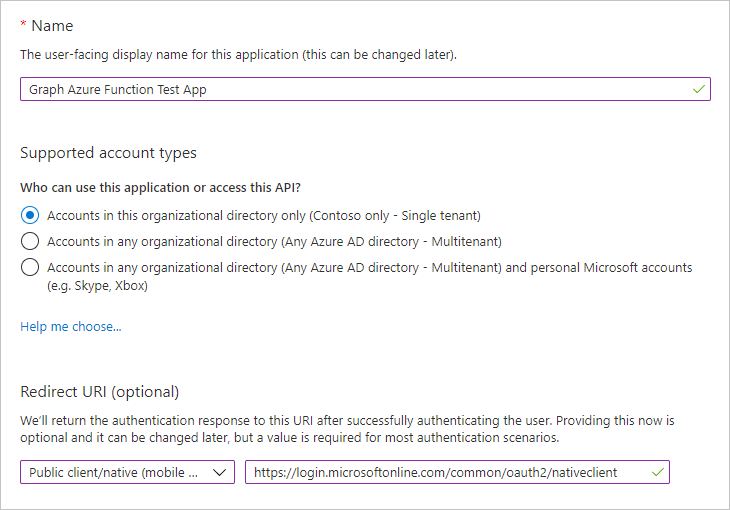
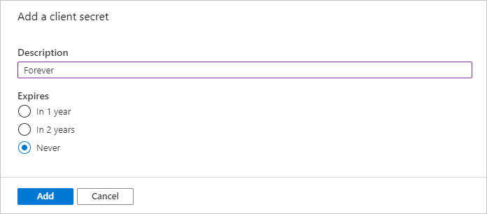

<!-- markdownlint-disable MD002 MD041 -->

Dans cet exercice, vous allez créer trois nouvelles applications Azure AD à l’aide du centre d’administration Azure Active Directory :

- Inscription d’application pour l’application à page unique afin qu’elle puisse se connecter aux utilisateurs et obtenir des jetons permettant à l’application d’appeler la fonction Azure.
- Inscription de l’application pour la fonction Azure qui lui permet d’utiliser le flux de la [part de](https://docs.microsoft.com/azure/active-directory/develop/v2-oauth2-on-behalf-of-flow) pour échanger le jeton envoyé par le spa pour un jeton qui lui permettra d’appeler Microsoft Graph.
- Inscription d’une application pour le webhook de fonction Azure qui lui permet d’utiliser le [flux d’informations d’identification du client](https://docs.microsoft.com/azure/active-directory/develop/v2-oauth2-client-creds-grant-flow) pour appeler Microsoft Graph sans utilisateur.

> [!NOTE]
> Cet exemple nécessite trois inscriptions d’application, car il implémente à la fois le flux de la part de et le flux d’informations d’identification du client. Si votre fonction Azure utilise uniquement l’un de ces flux, il vous suffit de créer les inscriptions d’application qui correspondent à ce flux.

1. Ouvrez un navigateur et accédez au [Centre d’administration Azure Active Directory](https://aad.portal.azure.com) et connectez-vous à l’aide d’un administrateur de l’organisation client Microsoft 365.

1. Sélectionnez **Azure Active Directory** dans le volet de navigation gauche, puis sélectionnez **Inscriptions d’applications** sous **Gérer**.

    

## Inscrire une application pour l’application à page unique

1. Sélectionnez **Nouvelle inscription**. Sur la page **Inscrire une application** , définissez les valeurs comme suit.

    - Définissez le **Nom** sur `Graph Azure Function Test App`.
    - Définissez les types de comptes **pris en charge** sur les **comptes dans ce répertoire d’organisation uniquement**.
    - Sous **URI de redirection** , définissez la liste déroulante sur **une application à page unique (Spa)** et définissez la valeur sur `http://localhost:8080` .

    

1. Sélectionner **Inscription**. Sur la page **application de test de fonction Azure Graph** , copiez les valeurs de l’ID d' **application (client)** et de l' **ID de répertoire (client)** , puis enregistrez-les dans les étapes ultérieures.

    

## Inscrire une application pour la fonction Azure

1. Revenez aux **inscriptions de l’application** et sélectionnez **nouvelle inscription**. Sur la page **Inscrire une application** , définissez les valeurs comme suit.

    - Définissez le **Nom** sur `Graph Azure Function`.
    - Définissez les types de comptes **pris en charge** sur les **comptes dans ce répertoire d’organisation uniquement**.
    - Laissez l' **URI de redirection** vide.

1. Sélectionnez **Inscrire**. Sur la page de la **fonction Graph Azure** , copiez la valeur de l' **ID d’application (client)** et enregistrez-la, vous en aurez besoin à l’étape suivante.

1. Sélectionnez **Certificats et secrets** sous **Gérer**. Sélectionnez le bouton **Nouveau secret client**. Entrez une valeur dans **Description** , sélectionnez une des options pour **Expire le** , puis sélectionnez **Ajouter**.

    

1. Copiez la valeur due la clé secrète client avant de quitter cette page. Vous en aurez besoin à l’étape suivante.

    > [!IMPORTANT]
    > Ce secret client n’apparaîtra plus jamais, aussi veillez à le copier maintenant.

    

1. Sélectionnez **autorisations d’API** sous **gérer**. Choisissez **Ajouter une autorisation**.

1. Sélectionnez **Microsoft Graph** , puis **autorisations déléguées**. Ajoutez **mail. Read** et sélectionnez **Ajouter des autorisations**.

    

1. Sélectionnez **exposer une API** sous **gérer** , puis choisissez **Ajouter une étendue**.

1. Acceptez l' **URI d’ID d’application** par défaut et choisissez **enregistrer et continuer**.

1. Renseignez le formulaire **Ajouter un étendue** comme suit :

    - **Nom de l’étendue :** Mail. Read
    - **Qui peut consentir ?:** Administrateurs et utilisateurs
    - **Nom d’affichage du consentement de l’administrateur :** Lire les boîtes de réception de tous les utilisateurs
    - **Description du consentement administratif :** Permet à l’application de lire la boîte de réception de tous les utilisateurs
    - **Nom d’affichage du consentement de l’utilisateur :** Lire votre boîte de réception
    - **Description du consentement de l’utilisateur :** Permet à l’application de lire votre boîte de réception
    - **État :** Activé

1. Sélectionnez **Ajouter une étendue**.

1. Copiez la nouvelle étendue, vous en aurez besoin plus tard.

    

1. Sélectionnez **manifeste** sous **gérer**.

1. Recherchez `knownClientApplications` dans le manifeste et remplacez sa valeur actuelle `[]` par `[TEST_APP_ID]` , où `TEST_APP_ID` est l’ID d’application de l’inscription de l’application de test de la **fonction Azure de graphique** . Sélectionnez **Enregistrer**.

> [!NOTE]
> L’ajout de l’ID d’application de l’application de test à la `knownClientApplications` propriété dans le manifeste de la fonction Azure permet à l’application de test de déclencher un [flux de consentement combiné](https://docs.microsoft.com/azure/active-directory/develop/v2-oauth2-on-behalf-of-flow#default-and-combined-consent). Cette opération est nécessaire au bon fonctionnement du flux de la part de.

## Ajouter une étendue de fonction Azure pour tester l’inscription de l’application

1. Revenez à la **fonction Azure de graphique test** de l’inscription de l’application, puis sélectionnez **autorisations d’API** sous **gérer**. Sélectionnez **Ajouter une autorisation**.

1. Sélectionnez **mes API** , puis **charger plus**. Sélectionnez **fonction Azure Graph**.

    

1. Sélectionnez l’autorisation **mail. Read** , puis sélectionnez **Ajouter des autorisations**.

1. Dans les **autorisations configurées** , supprimez l’autorisation **User. Read** sous **Microsoft Graph** en sélectionnant le **...** à droite de l’autorisation et en sélectionnant **Supprimer l’autorisation**. Sélectionnez **Oui, supprimer** pour confirmer.

    

## Inscrire une application pour le webhook de fonction Azure

1. Revenez aux **inscriptions de l’application** et sélectionnez **nouvelle inscription**. Sur la page **Inscrire une application** , définissez les valeurs comme suit.

    - Définissez le **Nom** sur `Graph Azure Function Webhook`.
    - Définissez les types de comptes **pris en charge** sur les **comptes dans ce répertoire d’organisation uniquement**.
    - Laissez l' **URI de redirection** vide.

1. Sélectionnez **Inscrire**. Sur la page **Graph de fonction Azure webhook** , copiez la valeur de l' **ID d’application (client)** et enregistrez-la, vous en aurez besoin à l’étape suivante.

1. Sélectionnez **Certificats et secrets** sous **Gérer**. Sélectionnez le bouton **Nouveau secret client**. Entrez une valeur dans **Description** , sélectionnez une des options pour **Expire le** , puis sélectionnez **Ajouter**.

1. Copiez la valeur du secret client avant de quitter cette page. Vous en aurez besoin à l’étape suivante.

1. Sélectionnez **autorisations d’API** sous **gérer**. Choisissez **Ajouter une autorisation**.

1. Sélectionnez **Microsoft Graph** , puis **autorisations d’application**. Ajoutez **User. Read. All** et **mail. Read** , puis sélectionnez **Ajouter des autorisations**.

1. Dans les **autorisations configurées** , supprimez l’autorisation **utilisateur délégué. lecture** sous **Microsoft Graph** en sélectionnant le **...** à droite de l’autorisation et en sélectionnant **Supprimer l’autorisation**. Sélectionnez **Oui, supprimer** pour confirmer.

1. Sélectionnez le bouton **accorder le consentement de l’administrateur pour...** , puis sélectionnez **Oui** pour accorder le consentement de l’administrateur pour les autorisations d’application configurées. La colonne **État** du tableau **autorisations configurées** passe à **accordé pour...**.

    
